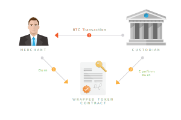

## WBTC - Implementation and Technology

### Use Case

- ##### Mint WBTC ( Merchant <=> Custodian )

- ##### Burn WBTC ( Merchant <=> Custodian )

- ##### Get WBTC ( User <=> Merchant )

- ##### Get BTC ( User <=> Merchant )

`User & Merchant` 之间的交易和 `Merchant & Custodian` 之间的交易是完全独立的，并不相互依赖。每个 Merchant 应当维护一个资金池，持有一定的 WBTC 与 BTC 储备方便与用户进行兑换。因为 Mint 与 Burn 会花费较多时间。

### Key Roles

- ##### Custodian - 托管人
    持有资产的机构或当事人。在 WBTC 中由 BitGo 保管资产。<u>Custodian 负责 `mint WBTC`</u>。

- ##### Merchant - 商家
    负责 mint 和  burn WBTC 的机构。Merchant 在 WBTC 的分发中扮演着十分重要的角色。每个 Merchant 都可以<u>发起 `mint WBTC` 和 `burn WBTC` 请求</u>。

- ##### User - 用户
    WBTC 的持有者。用户可以像以太坊生态系统中任意其他 ERC20 Token 一样交易 WBTC。<u>用户不参与 WBTC 的 Mint 与 Burn 过程</u>。

- ##### WBTC DAO member - 成员
    `合约变更`、`保管人和商家的变动`由 `multi-signature wallets` 控制。<u>机构作为 Member，多签钱包的 owners 由机构控制</u>。

### Custodian wallet setup

Custodian 将为所有商家提供汇总钱包。钱包使用 `multi-signature`，所有密钥由 `custodian` 控制。钱包只能发送到链上列入白名单的商家地址。所有 mint 和 burn 交易预计将在提交给 custodian 的48小时内完成。如果有多个 Custodian，则单个 Custodian 的 BTC 钱包可能没有足够的资金来兑换所有待处理的 WBTC。
<u>以上设计用于多 Custodian 情景，但目前 WBTC 只有 Bitgo 一个 Custodian，且其钱包合约代码尚未公开，上述内容暂时无法验证。</u>

---

### Contracts Of WBTC

- **MultiSigWalletWithDailyLimit：** 执行 DAO 管理交易，管理 DAO Members
- **Members：** 负责查询与管理 Merchants 和 Custodian
- **Factory：** 发起 Mint 与 Burn 的 Request
- **Controller：** 执行 Mint WBTC 与 Burn WBTC，管理 Factory 与 Members 合约
- **WBTC：** ERC20 Token

---

### Ethereum Multi-Signature Wallets

`M of N` 多签钱包模型。N 为总数，M 为交易通过的签名个数。多签钱包合约中，每个 owner 都可以提交交易，交易提交后需要其他 owners 同意，当超过 Required 数量的 owner 同意后，任何一个 owner 都可以执行该交易。多签钱包合约 owners 的管理也是通过上述过程完成。

> Multi-Signature Wallets 中每个 owner 都只有一票，不含权重信息。PegZone 中 Oracle Module 是一个类似的包含权重的多签交易管理的实现。

---

### Governance

所有托管人和商人都是DAO Member，但其他机构也可以作为 Member 加入，但没有 Custodian 或 Merchant 角色。
- ##### 合约管理： Factory、Members
- ##### 角色管理： Custodians、Merchants
- ##### 成员管理： 两个多签钱包的 Owners

> Factory 支持多个 Custodian，但 Members 只支持单一托管人，后期若要增加 Custodian 需更新 Controller 中的 Member 合约。

---

### Minting

Minting 是指创建新的 WBTC 的过程。必须由 `custodian` 完成，但需要由 `merchant` `发起(initiate)`。<u>Minting 不涉及用户。它是 **merchant** 和 **custodian** 之间完成的一组交易。</u>

#### Sequence of minting events for WBTC

- Merchant `发起(initiate)` 一个交易，授权 custodian 向以太坊上的 merchant 地址发行 X 个 WBTC。
- Merchant 向 Custodian 发送 X 个 BTC。
- Custodian 等待 BTC 交易的确认 (6个新块)。
- Custodian `确认(confirm)` Merchant 发起的 Mint 请求。

**执行流程如下图所示:** 

 

**智能合约调用如下图所示:** 

#### Sequence of events for users to receive WBTC tokens

- 用户向一个 merchant 发起兑换 WBTC 请求。
- Merchant 执行必要的 KYC/AML 程序，并获取用户的身份证明信息。
- 用户和商家执行原子交换，或通过可信的方式交换 BTC 和 WBTC。用户收到 WBTC，Merchant 收到 BTC。

>Note：该部分由每个 merchant 单独实现。

---

### Burning

Burning 是指将 WBTC 兑换回 BTC，只有 `Merchant` 地址可以 burn WBTC。Merchant 在合约中调用 burn 函数并传入数量，merchant 账户中相应数量的 WBTC 将会被扣除，并且 WBTC 总量会相应减少。<u>Minting 也不涉及用户。它是 **merchant** 和 **custodian** 之间完成的一组交易。</u>

#### Sequence of events for burning WBTC tokens
- Merchant 创建一个 `burn request` transaction，销毁 X 个 WBTC。
- Custodian 等待以太坊 25 个区块确认交易成功。
- Custodian 向 Merchant 的 BTC 地址上发送 X 个BTC。
- Custodian 在以太坊上将该 burn request 标记为 `completed`

**执行流程如下图所示:** 

 

**智能合约调用如下图所示:** 

#### Sequence of events for users to receive Bitcoins
- 用户向一个 Merchant 发起 WBTC 兑换 BTC 请求。
- Merchant 执行必要的 KYC/AML 程序，并获取用户的身份证明信息。
- 用户和商家执行原子交换，或通过可信的方式交换 BTC 和 WBTC。用户收到 BTC，Merchant 收到 WBTC。

> 注：该部分由每个 merchant 单独实现。

#### Atomic Swap <u>( HTLC => WBTC & BTC )</u>

Atomic swaps can be used between merchants and users in order to exchange WBTC and BTC. If the user would like to receive WBTC or BTC more quickly, a trusted method of exchange could also be done through the merchants.
Once KYC is completed, the steps for users to atomically swap BTC for WBTC with the merchant are:
- User generates a secret and a hash of it is provided to the merchant off chain. The user and the merchant also agree on other swapping details such as receive addresses (ETH and BTC)
- The user creates a Bitcoin HTLC (Hashed Time Lock Contract) using the merchant’s Bitcoin address, user’s refund address, secret hash, and expiration time. This is used to create a P2SH address which the user funds with X BTC
- After 6 confirmations, the merchant will create an HTLC contract on Ethereum, by using the user’s Ethereum address, merchant’s refund address, secret hash, and expiration time. The merchant then transfers X WBTC to the atomic swap contract.
- The user reveals the secret in order to move X WBTC from the atomic swap contract to the user’s Ethereum address
- The merchant uses the secret in order to move Bitcoin funds from the P2SH address
- If the user does not claim the WBTC within the expiration time, the transaction does not go through and the user can claim the BTC back

Some important things to note here:
- In order to deploy the atomic swap contract and send WBTC to it, there are transaction fees involved. Hence, the user will have to pay an <u>atomic swap fee</u> before initiating a swap.
- Atomic swaps take time and multiple transactions on both the BTC and ETH chain. The user may have the option of doing a trusted swap in which BTC is transferred to the merchant address and after 6 confirmations on the bitcoin network, the merchant sends WBTC to the user. <u>This involves trust in the merchant, but it is quicker and cheaper.</u>

#### Fees
Transfers of WBTC between users will have no cost apart from <u>network fees</u>. There are three ways in which different parties in the network can earn fees:
- **Custodian fees:** This is taken by the custodian at the time when a merchant mints or burns wrapped tokens.
- **Merchant fees:** This is taken by the merchant who the user exchanges wrapped tokens with for the asset.

#### Transparency
There will be full transparency in the functioning of the wrapped token. All key details of the network will be reflected in a dashboard, some of which are:
- **机构信息：** Names and details of institutions performing different roles in the network
- **订单状态：** Status of mint and burn orders (pending, processing, cancelled, complete)
- **储备证明：** Total amount of BTC stored by custodians
- **WBTC总量：** Total amount of WBTC in the network (Will be the same or slightly lower than BTC stored)
- **季度审计：** Quarterly audits in the form of transactions which prove that the custodian has the keys to the Bitcoin
- **以太地址：** Merchant and Custodians ethereum addresses
- **比特币地址：** The Bitcoin address associated with each merchant, controlled by the custodian
- **智能合约：** Links to the open source token contract code / deployed contract on a block explorer